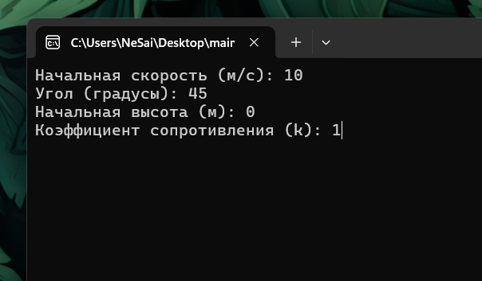
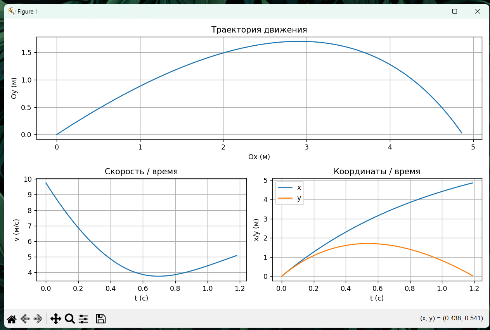
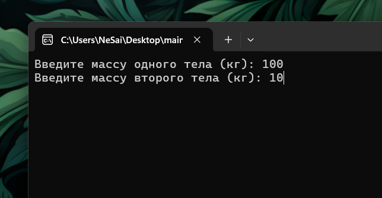
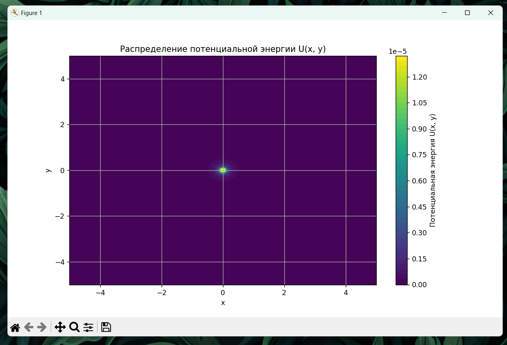

# Задание ко 7-й лекции по Физическим основам компьютерных систем

Вариант 1

ОПАЗДАЛ С ОТПРАВКОЙ НА 1 МИНУТУ

## Установка прогарам:

1. Справа, в разделе Releases открыть релиз "Лекции 5-7"
2. Установить архивы main1.zip и main2.zip
3. Распаковать архивы
4. Программа main1.exe - это первое задание, main2.exe - второе.

## Задание 1 - программа, визуализирующая траекторию движения тела, брошенного под углом к горизонту, с учётом силы сопротивления воздуха.

## Использованные библиотеки:

- numpy (библиотека для математических операций)
- matplotlib (библиотека для построения графиков)

## Физические формулы:

$\vec g=9.81$ - ускорение свободного падения  
$m=1$ - масса тела (в программе масса тела берётся за 1 кг)
$k$ - коэффициент сопротивления воздушной среды  
$\vec v$ - полная моментальная скорость  
$\vec a$ - полное моментальное ускорение  

$t$ - время  
$\alpha$ - угол броска

$$\vec F_{сопр}=-k\vec v$$
$$\vec a = \vec g+\frac{\vec F_{сопр}}{m}$$

---

### Итеративные расчёты:

Основные расчёты происходят итеративно с момента броска ($t_0$), до приземления тела. Промежуток измерений - $\Delta t$

$$\vec F_{сопр\ n} = -k\vec v_n$$
$$\vec a_{n+1} = \vec g+\frac{\vec F_{сопр\ n}}{m}$$
$$\vec v_{n+1} = \vec v_n+\vec a_n\cdot\Delta t$$
$$x_{n+1}=x_{n}+v_{xn}\cdot\Delta t$$
$$y_{n+1}=y_{n}+v_{yn}\cdot\Delta t$$

## Сценарий взаимодействия с программой:

1. Запустить программу (main1.exe)
2. В терминале, программа попросит ввести начальные данные: скорость, угол, начальную скорость, начальную высоту
3. После ввода начальных данных терминал закроется и появится визуальный интерфейс, в котором будут три графика: траектория движения тела, графики зависимости скорости от времени, и график зависимости координат (x и y) от времени.

### Скриншоты

#### Терминал

#### Визуальный интерфейс

## Задание 2 - Моделирование потенциального поля (распределение силы гравитации)

## Использованные библиотеки:

- numpy (библиотека для математических операций)
- matplotlib (библиотека для построения графиков)

## Физические формулы:

$G = 6,6743\cdot 10^-11$ - гравитационна постоянная

---

$$F_{тягот}=G\cdot\frac{m_1\cdot m_2}{r^2}$$

## Сценарий взаимодействия с программой:

1. Запустить программу (main2.exe)
2. В терминале, программа попросит ввести начальные данные: массу первого и второго тел.
3. После ввода начальных данных терминал закроется и появится визуальный интерфейс, в котором будет отображено поле.

### Скриншоты

#### Терминал

#### Визуальный интерфейс

