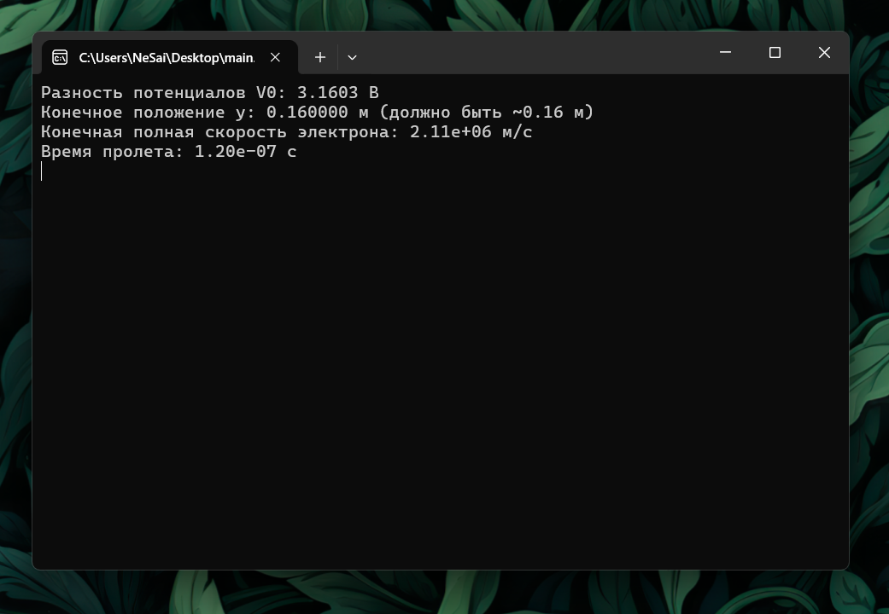
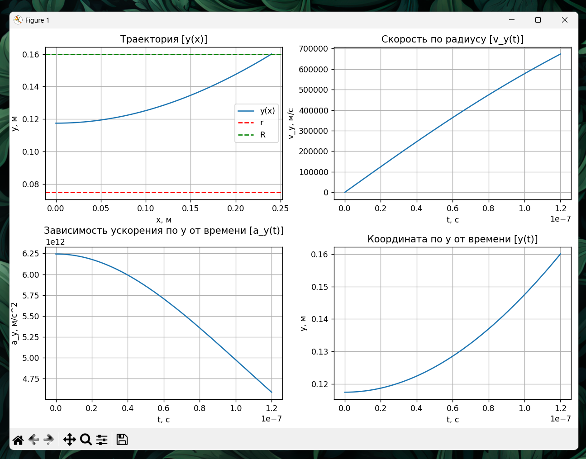

# Задание к 14-й лекции по Физическим основам компьютерных систем

Вариант 2

## Установка прогарам:

1. Справа, в разделе Releases открыть релиз "Лекция 14"
2. Установить архив main.zip
3. Распаковать архив
4. main.exe - файл программы.

## Программа, визуализирующая границу раздела двух диэлектриков.

## Использованные библиотеки:

- numpy (библиотека для математических операций)
- matplotlib (библиотека для построения графиков)

## Физические формулы:

$\theta$ - угол электрического поля.
$\varepsilon$ - диэлектрическая проходимость среды.

Закон Снелла:
$$\frac{\sin{\theta_1}}{\sin{\theta_2}}=\frac{\varepsilon_2}{\varepsilon_1}$$

## Сценарий взаимодействия с программой:

1. Запустить программу (main.exe)
2. В терминале, программа попросит ввести начальные данные: диэлектрические проницаемости двух сред, модуль и направление напряженности.
3. После ввода начальных данных, терминал выведет модуль напряжённости и угол электрического поля для обeих сред.

### Скриншоты

#### Терминал

#### Визуальный интерфейс

