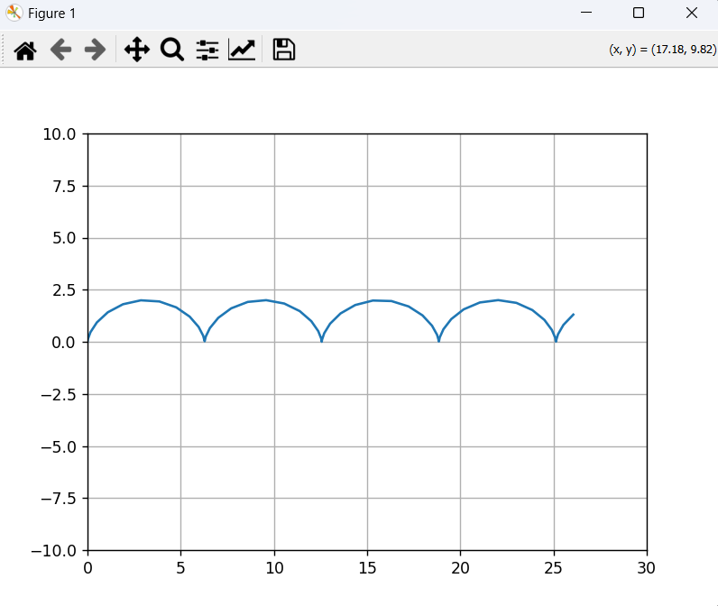

# Задание к 3-й лекции по Физическим основам компьютерных систем

Вариант 2 - программа визуализирующая движение точки на ободе колеса

## Установка программы：

1. Справа, в разделе Releases открыть релиз “Лекция 3”
2. Установить архив main.zip
3. Распаковать архив
4. Запустить программу main.exe

## Использованные библиотеки:

- numpy (библиотека для математических операций)
- matplotlib (библиотека для построения графиков)

## Физические формулы:

$$x=r\cdot(t-\sin t)$$  

$$y=r\cdot(1-\cos t)$$  

$$\alpha=\frac{V}{r}$$

## Сценарий взаимодействия с программой:

1. Запустить программу (main.exe)
2. В терминале, программа попросит ввести начальные данные: радиус и скорость центра масс
3. После ввода начальных данных терминал закроется и появится визуальный интерфейс, в котором будет график изображающий траекторию движения точки на ободе колеса.

### Скриншоты
#### Терминал

#### Визуальный интерфейс

