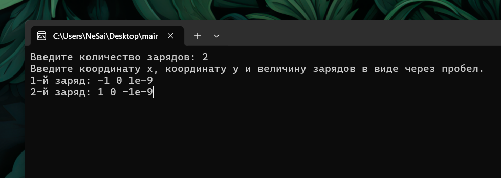
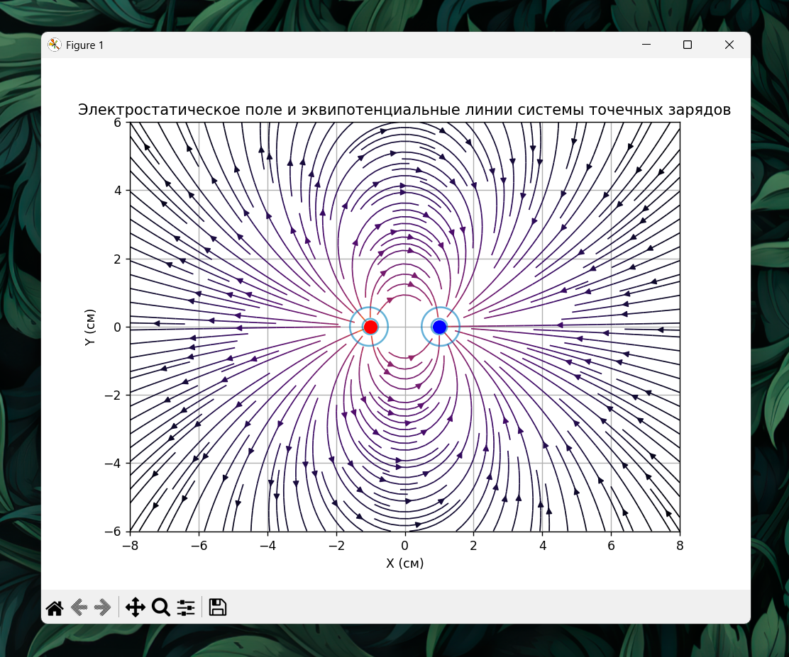

# Задание к 12-й лекции по Физическим основам компьютерных систем

Вариант 2

## Установка прогарам:

1. Справа, в разделе Releases открыть релиз "Лекция 12"
2. Установить архив main.zip
3. Распаковать архив
4. main.exe - файл программы.

## Программа, визуализирующая электростатическое поле системы неподвижных точечных зарядов в двумерном пространстве.

В дополнение к основному заданию, программа реализована таким образом, что количество точек, и их положение можно задавать самостоятельно.

## Использованные библиотеки:

- numpy (библиотека для математических операций)
- matplotlib (библиотека для построения графиков)

## Физические формулы:

$k=8.988\cdot 10^9\ (\frac{Н\cdot м^2}{Кл^2})$ - Кулоновская константа.  
$q\ (Кл)$ - заряд.  
$r\ (м)$ - расстояние от заряда до точки, в которой вычисляется поле.  
$\hat{r}$ - единичный вектор, указывающий от заряда к точке наблюдения.

$$V=\frac{k\cdot q}{r}$$ - Потенциал электрического поля точечного заряда.

$$\vec{E}=k\cdot\frac{q}{r^2}\cdot\hat{r}$$ - Закон Кулона.  
$$\vec{E}_{общ}=\sum_{i=1}^{N}{\vec{E}_i}$$ - Принцип суперпозиции электрических полей.  
$$E_x=E\cdot\cos{\theta};$$  
$$E_y=E\cdot\sin{\theta}$$ - Разложение вектора электрического поля на компоненты.  

## Сценарий взаимодействия с программой:

1. Запустить программу (main.exe)
2. В терминале, программа попросит ввести начальные данные: количество зарядов, их координаты и величину. (Все значения поддерживают научную нотацию с помощью e)
3. После ввода начальных данных терминал закроется и появится визуальный интерфейс, в котором будет изображено электромагнитное поле, создаваемое данной системой неподвижных зарядов.

### Скриншоты

#### Терминал

#### Визуальный интерфейс

