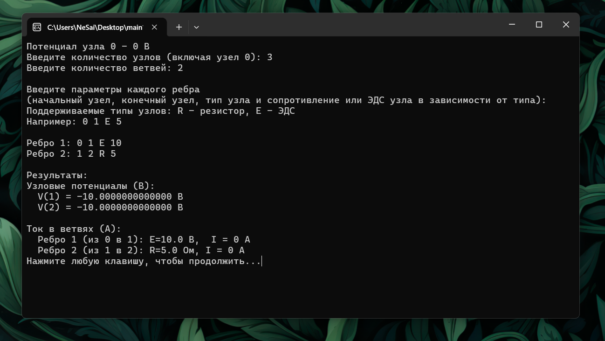
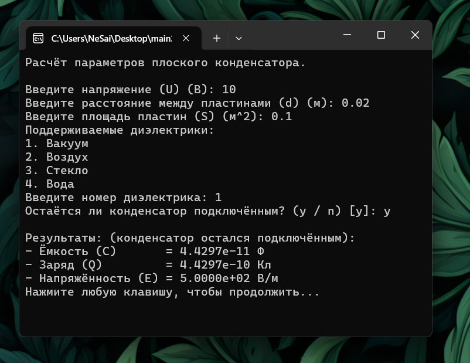

# Задание ко 14-15й лекциям по Физическим основам компьютерных систем

Вариант 2

## Установка прогарам:

1. Справа, в разделе Releases открыть релиз "Лекция 15"
2. Установить архивы main1.zip и main2.zip
3. Распаковать архивы
4. Программа main1.exe - это первое задание, main2.exe - второе.

## Задание 1 - программа, рассчитывающая точки в электронной схеме.

## Использованные библиотеки:

- sympy - (библиотека алгебраических операций)

## Физические формулы:

Закон Ома:
$$R=\frac{U}{I}$$

## Сценарий взаимодействия с программой:

1. Запустить программу (main1.exe)
2. В терминале, программа попросит ввести начальные данные: Информацию о схеме (количество узлов, рёбер, их параметры)
3. После ввода начальных данных программа выводит ток во всех узлах схемы.

### Скриншоты

#### Терминал

--- 

## Задание 2 - Моделирование потенциального поля (распределение силы гравитации)

## Физические формулы:

Электроёмкость плоского конденсатора.
$$C=\frac{\varepsilon\varepsilon_0 S}{d}$$

Заряд на пластинах конденсатора:
$$Q=\frac{E}{Cd}$$

## Сценарий взаимодействия с программой:

1. Запустить программу (main2.exe)
2. В терминале, программа попросит ввести начальные данные: известные данные о конденсаторе.
3. После ввода начальных данных программа выводит рассчитанные параметры конденсатора

### Скриншоты

#### Терминал

