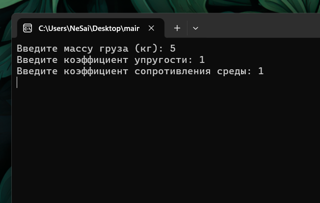
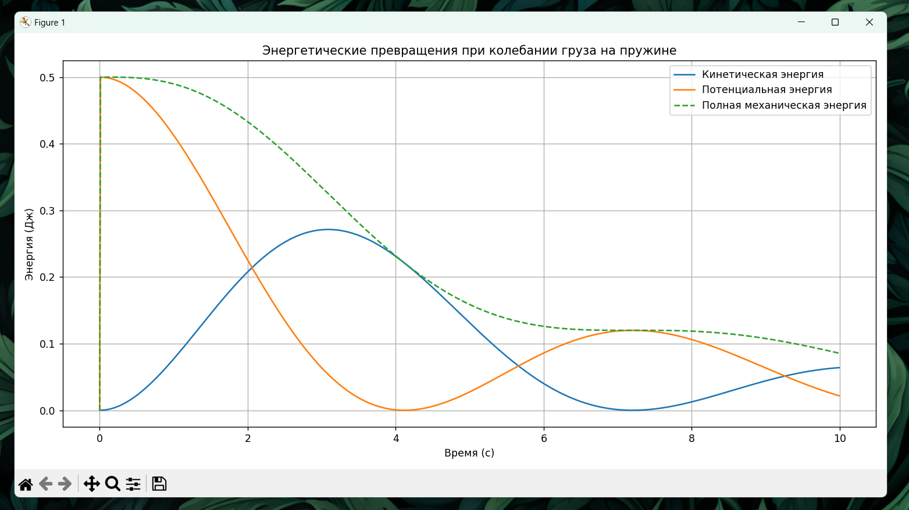

# Задание ко 8-й лекции по Физическим основам компьютерных систем

Вариант 1

## Установка прогарам:

1. Справа, в разделе Releases открыть релиз "Лекции 8"
2. Установить архивы main.zip
3. Распаковать архивы
4. main.exe - файл программы

## Использованные библиотеки:

- numpy (библиотека для математических операций)
- matplotlib (библиотека для построения графиков)

## Физические формулы:

$m$ - (кг) масса груза  
$k$ - коэффициент жёсткости пружины  
$c$ - коэффициент сопротивления среды  
$h(t) / x(t)$ - (м) смещение груза от положения равновесия в момент времени $t$  

---

$$m\frac{d^2x}{dt^2}=-kx-c\frac{dx}{dt}$$

### Итеративные расчёты:

Основные расчёты происходят итеративно, до приземления тела. Промежуток измерений - $\Delta t$

## Сценарий взаимодействия с программой:

1. Запустить программу (main.exe)
2. В терминале, программа попросит ввести начальные данные: 
3. После ввода начальных данных терминал закроется и появится визуальный интерфейс, в котором будет график: зависимость энергии от времени.

### Скриншоты

#### Терминал

#### Визуальный интерфейс

