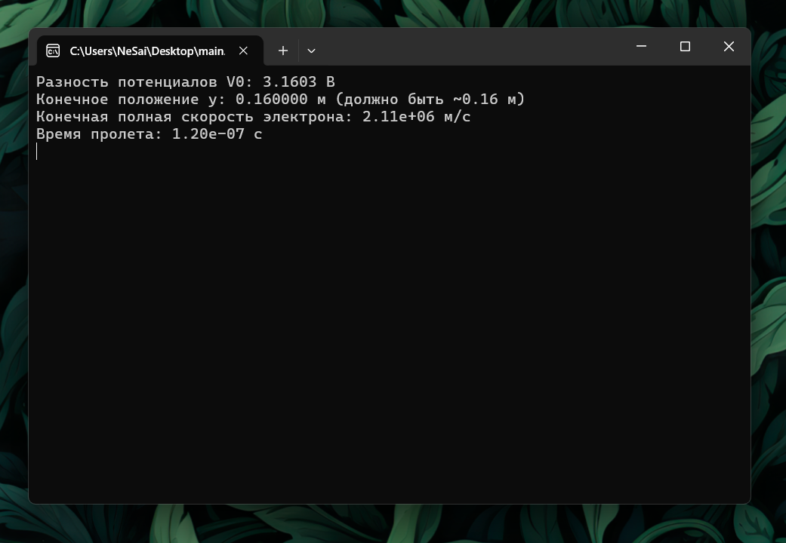
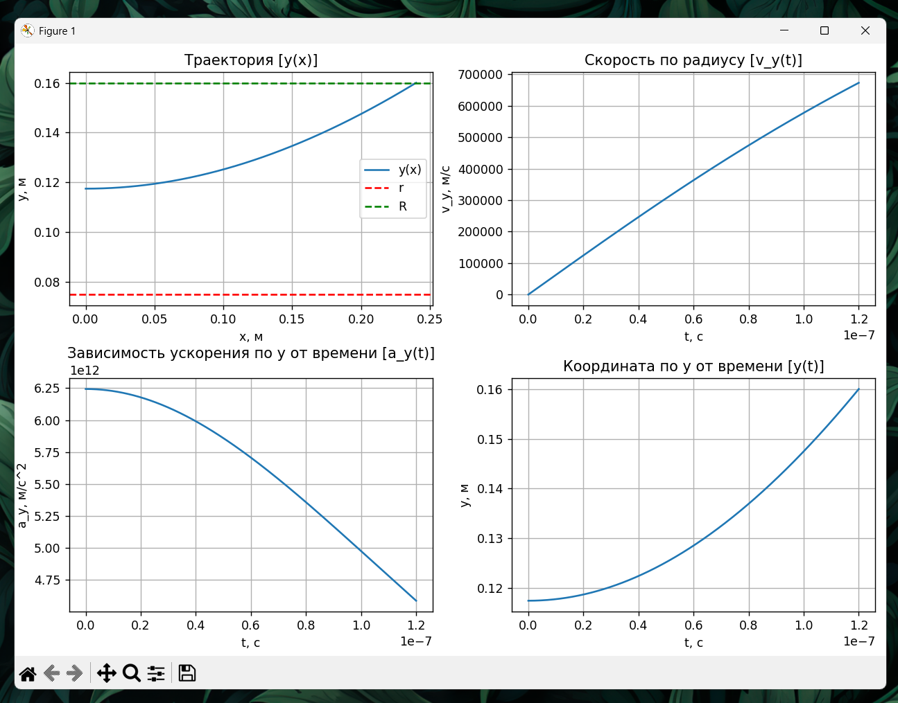

# Моделирование №2

Вариант 14

## Задание "Частица в конденсаторе"

Электрон влетает в цилиндрический конденсатор с начальной скоростью $v_0$, посередине между
обкладками, параллельно образующим цилиндра. При какой минимальной разности потенциалов,
приложенной к обкладкам, электрон не успеет вылететь из конденсатора. Краевыми эффектами
пренебречь.  
Построить графики зависимости $y(x)$, $v_y(t)$, $a_y(t)$, $y(t)$.  
Рассчитать время полета t и конечную скорость электрона $v_{кон}$.

## Исходные данные:

Внутренний радиус: $r=0.075(м)$  
Внешний радиус: $R=0.16(м)$  
Начальная скорость: $v_0=2\cdot10^6(м/c)$  
Длина конденсатора: $l=0.24(м)$  

## Установка программы:

1. Справа, в разделе Releases открыть релиз "Моделирование 2"
2. Установить архив main.zip
3. Распаковать архив
4. main.exe - файл программы.

## Снимки экрана:

### Терминал

### Графики

